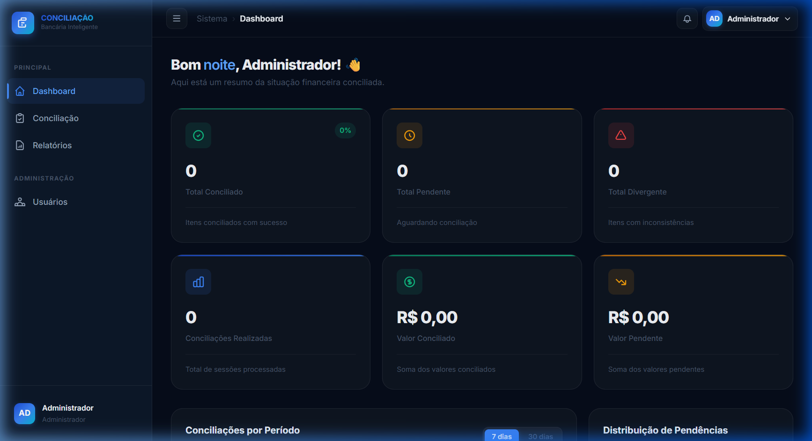

<div align="center">

# 🏦 Sistema de Conciliação Bancária

### Conciliação bancária **inteligente** e automática com IA

[](https://developer.mozilla.org/en-US/docs/Web/HTML)
[](https://developer.mozilla.org/en-US/docs/Web/CSS)
[](https://developer.mozilla.org/en-US/docs/Web/JavaScript)
[](https://www.chartjs.org/)
[](LICENSE)

<p align="center">
  <strong>Reduza até 90% do trabalho manual</strong> com nosso motor de conciliação que compara automaticamente extratos bancários com seus registros internos usando inteligência artificial.
</p>

<br/>

[🚀 **Demo ao Vivo**](https://bia-farias.github.io/SISTEMA-DE-CONCILIA--O-BANCARIA/) · [📋 Features](#-features) · [🛠️ Tech Stack](#️-tech-stack) · [📖 Como Usar](#-como-usar)

<br/>

</div>

---

## 📸 Screenshots

<div align="center">

### Tela de Login


<br/><br/>

### Dashboard


</div>

---

## ✨ Features

### 🔄 Motor de Conciliação Automática
- **7 estratégias de comparação** — conciliação exata, tolerância de data, similaridade de texto, faixa de valor, detecção de duplicidades, agrupamento e sugestões de IA
- **4 modos de reconciliação** — 1:1 (padrão), N:1 (agrupamento ERP), 1:N (agrupamento banco), N:N (completo)
- **Subset Sum Algorithm** — encontra combinações de lançamentos que totalizam um valor correspondente
- **Configuração flexível** — tolerância de data (dias) e valor (%) ajustáveis

### 🤖 Inteligência Artificial
- Score de confiança em tempo real para cada correspondência
- Sugestões inteligentes baseadas em padrões de texto e valor
- Similaridade de texto com algoritmo de distância de Levenshtein
- Aprendizado de padrões de conciliação anteriores

### 📊 Dashboard Gerencial
- KPIs em tempo real (conciliados, pendentes, divergentes)
- Gráficos interativos com Chart.js (tendências e distribuição)
- Atividade recente e notificações
- Saudação dinâmica por horário do dia

### 📁 Importação Multi-formato
- **OFX/QFX** — extrato bancário padrão
- **CSV** — arquivos delimitados com detecção automática de separador
- **XLSX/XLS** — planilhas Excel
- Drag & drop para upload de arquivos
- Parser inteligente com normalização automática de datas e valores

### 📄 Relatórios e Exportação
- Histórico de todas as sessões de conciliação
- Exportação para **Excel** (.xlsx) com formatação profissional
- Exportação para **PDF** com tabelas e resumo
- Filtros por status, busca textual e detalhamento por sessão

### 👥 Gestão de Usuários e Segurança
- **3 perfis de acesso**: Administrador, Analista, Auditor
- RBAC (Role-Based Access Control) com permissões granulares
- Autenticação com hash SHA-256 (Web Crypto API)
- Sessões com expiração automática (8h)
- Log de auditoria completo

### 🎨 Design Premium
- Dark theme com glassmorphism e micro-animações
- Design system com CSS custom properties (60+ tokens)
- Layout responsivo (desktop, tablet, mobile)
- Fonte Inter com tipografia profissional
- Scrollbar e componentes customizados

---

## 🛠️ Tech Stack

| Tecnologia | Uso |
|---|---|
| **HTML5** | Estrutura semântica e SEO |
| **CSS3** | Design system com custom properties, glassmorphism, animações |
| **JavaScript (ES6+)** | Lógica de negócio modular (11 módulos) |
| **Chart.js** | Gráficos interativos (tendência, donut) |
| **PapaParse** | Parser de CSV |
| **SheetJS** | Leitura e escrita de XLSX |
| **jsPDF** | Geração de relatórios em PDF |
| **Web Crypto API** | Hash de senhas SHA-256 |
| **LocalStorage** | Persistência de dados no navegador |

> 💡 **100% client-side** — Não precisa de backend, banco de dados ou servidor. Tudo roda no navegador!

---

## 📖 Como Usar

### 🌐 Demo Online

Acesse a [**demo ao vivo**](https://bia-farias.github.io/SISTEMA-DE-CONCILIA--O-BANCARIA/) e use as credenciais abaixo:

| Perfil | Usuário | Senha |
|---|---|---|
| 🔴 Administrador | `admin` | `admin123` |
| 🔵 Analista | `analista` | `analista123` |
| 🟣 Auditor | `auditor` | `auditor123` |

### 💻 Rodando Localmente

```bash
# Clone o repositório
git clone https://github.com/Bia-farias/SISTEMA-DE-CONCILIA--O-BANCARIA.git

# Acesse a pasta
cd SISTEMA-DE-CONCILIA--O-BANCARIA

# Abra no navegador (ou use Live Server no VS Code)
start index.html
```

> **Dica:** Para melhor experiência, use a extensão [Live Server](https://marketplace.visualstudio.com/items?itemName=ritwickdey.LiveServer) no VS Code.

---

## 📁 Arquitetura

```
📦 SISTEMA-DE-CONCILIAÇÃO-BANCARIA
├── 📄 index.html            # Tela de Login
├── 📄 dashboard.html        # Dashboard com KPIs e gráficos
├── 📄 conciliacao.html      # Workspace de conciliação
├── 📄 relatorios.html       # Histórico e exportação
├── 📄 usuarios.html         # Gestão de usuários (admin)
│
├── 📁 css/
│   ├── 🎨 global.css        # Design system (tokens, reset, componentes base)
│   ├── 🎨 auth.css          # Estilos da tela de login
│   ├── 🎨 components.css    # Sidebar, header, cards, charts
│   ├── 🎨 conciliacao.css   # Upload, preview, resultados
│   └── 🎨 dashboard.css     # KPIs, welcome, charts
│
├── 📁 js/
│   ├── ⚙️ storage.js        # Persistência (localStorage) + Audit Log
│   ├── 🔐 auth.js           # Autenticação, sessão, RBAC
│   ├── 🔧 normalizer.js     # Normalização de datas, valores, moedas
│   ├── 📂 parser.js         # Parser OFX, CSV, XLSX + dados demo
│   ├── 🤖 ai.js             # Motor de IA (similaridade, sugestões)
│   ├── 📦 grouping.js       # Agrupamento N:1, 1:N, N:N + Subset Sum
│   ├── 🔄 engine.js         # Motor de conciliação (7 estratégias)
│   ├── 📊 charts.js         # Gráficos Chart.js (trend, donut)
│   ├── 📄 reports.js        # Exportação Excel + PDF
│   ├── 🖥️ app.js            # UI helpers, toasts, sidebar, logout
│   └── 👥 usuarios.js       # CRUD de usuários
│
├── 📁 docs/
│   ├── 🖼️ screenshot-login.png
│   └── 🖼️ screenshot-dashboard.png
│
├── 📄 .gitignore
├── 📄 LICENSE               # MIT
└── 📄 README.md
```

---

## 🔒 Segurança

- Senhas hasheadas com **SHA-256** via Web Crypto API
- Sessões com expiração automática de **8 horas**
- **RBAC** com 3 níveis de acesso
- Whitelist de campos ao criar/editar usuários (prevenção de privilege escalation)
- Validação de perfil em todas as rotas
- Log de auditoria com rastreamento de ações

---

## 📝 Licença

Este projeto está licenciado sob a [MIT License](LICENSE).

---

<div align="center">

**Feito com 💙 por [Bia Farias](https://github.com/Bia-farias)**

⭐ Se este projeto foi útil, considere dar uma estrela!

</div>
